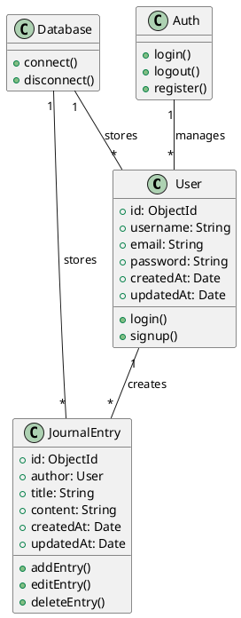

```plantuml
@startuml
class User {
  +id: ObjectId
  +username: String
  +email: String
  +password: String
  +createdAt: Date
  +updatedAt: Date
  +login()
  +signup()
}

class JournalEntry {
  +id: ObjectId
  +author: User
  +title: String
  +content: String
  +createdAt: Date
  +updatedAt: Date
  +addEntry()
  +editEntry()
  +deleteEntry()
}

class Auth {
  +login()
  +logout()
  +register()
}

class Database {
  +connect()
  +disconnect()
}

User "1" -- "*" JournalEntry : creates
Auth "1" -- "*" User : manages
Database "1" -- "*" User : stores
Database "1" -- "*" JournalEntry : stores
@enduml
```